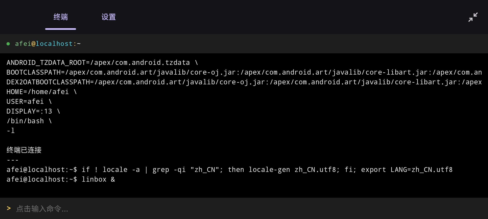
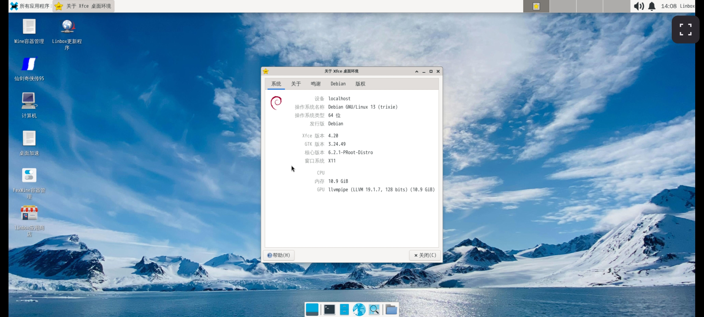
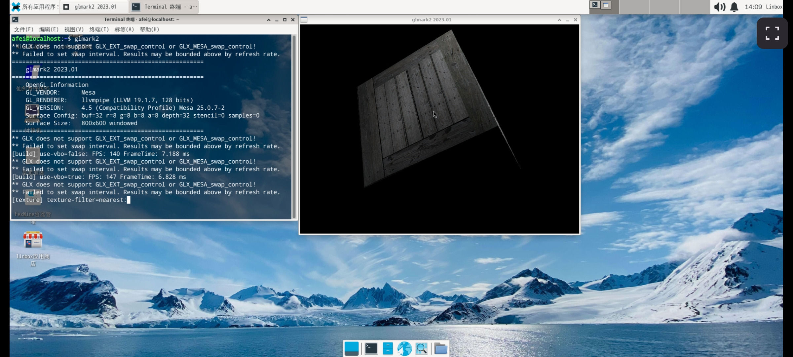

# Linbox-WinEmu

    

## 项目简介

Linbox-WinEmu（原 WinEmulator）是一款运行在 Android 设备上的 Linux 环境模拟器，通过利用 PRoot、Box64/86、Termux-X11 等技术，在 Android 手机或平板上创建一个完整的 Linux 容器环境，从而实现运行 Windows 应用程序和游戏的目的。本应用支持自定义分辨率、多种输入模式、Wine 兼容层配置以及 DXVK/VKD3D 图形加速，适用于办公、娱乐和游戏等多种场景。

本项目由 ewt45 发起，afeimod 持续维护更新。

    <table>
        <tr>
            <td></td>
            <td></td>
            <td></td>
        </tr>
    </table>

## 核心功能

Linbox-WinEmu 提供了以下核心功能，以满足用户在 Android 设备上运行 Linux 和 Windows 应用的需求：

### PRoot 容器环境

应用内置 PRoot 技术，无需 root 权限即可在 Android 设备上运行完整的 Linux 容器。支持切换不同的 Linux 发行版 rootfs，兼容 Debian、Ubuntu、Arch Linux 等多种发行版。每个容器可以独立配置语言环境、共享文件夹和启动命令。

### X11 显示服务

集成 Termux-X11 作为 X11 服务器，支持自定义分辨率（从 800x600 到 1920x1080 等多种预设，并支持自定义分辨率）。提供三种触摸操作模式：虚拟触控板模式适合精确光标控制；模拟触摸模式支持单指点击和长按右键；触摸屏模式则直接在屏幕上操作。

### Wine 兼容层

支持多种 Wine 版本安装和管理，包括 wine-ge-custom、wine-tkg 等优化版本。内置 DXVK、DXVK-ASYNC、DXVK-GPLASYNC 等 DirectX 到 Vulkan 的转换层，以及 VKD3D（Direct3D 12 到 Vulkan）和 D8VK（Direct3D 8 到 Vulkan）支持，显著提升 Windows 游戏的图形性能。

### Box64/86 模拟器

内置 Box64 和 Box86 模拟器，使 ARM64/Android 设备能够运行 x86_64 和 x86 架构的 Linux 和 Windows 程序。通过动态翻译技术，在移动设备上实现更广泛的软件兼容性。

### 音频系统

集成 PulseAudio 音频服务，支持 Wine 和 Linux 应用的音频输出。配置简单，开箱即用。

### 输入控制系统

功能完善的虚拟输入控制系统，支持创建和管理多个控制配置文件。每个配置文件可以包含虚拟按键、虚拟摇杆、鼠标区域等控件元素。支持导入导出配置，方便用户分享和备份。

## 快速上手指南

按照以下步骤，您可以快速在 Android 设备上启动 Linux 环境并运行 Windows 程序。

### 准备工作

在开始使用 Linbox-WinEmu 之前，请确保完成以下准备工作。首先，进入手机设置，开启开发者选项。在开发者选项中，找到并勾选「USB 调试」和「USB 安装」选项。随后，找到「后台进程限制」或「停止限制子进程」选项，勾选「不允许后台进程被限制」或类似的选项。这一步非常重要，可以避免应用在后台运行时出现报错 9（崩溃/闪退）的问题。

如果应用提示需要存储权限，请授予「管理所有文件」的权限，以便应用能够访问和修改文件系统。

### 创建第一个容器

首次启动应用后，您需要创建一个 Linux 容器。在应用主界面，点击「新建容器」按钮。系统将提示您选择 Linux 发行版，推荐新手选择预置的 rootfs 镜像。等待系统下载并解压 rootfs 文件，这可能需要几分钟时间，取决于您的网络速度和存储空间。

容器创建完成后，在「Rootfs 切换」设置中，选择您刚创建的容器作为当前使用的容器。

### 安装 Wine

在容器创建完成后，进入「Wine 设置」面板。点击「安装 Wine」按钮，选择一个适合您需求的 Wine 版本。对于游戏应用，推荐选择带有 Gallium Nine 支持的版本以获得更好的性能；对于普通 Windows 程序，标准版本通常足够使用。Wine 安装过程会在后台进行，您可以在通知栏查看进度。

### 启动环境并运行程序

完成以上设置后，返回应用主界面，点击「启动」按钮。应用将依次启动 PRoot 容器和 X11 服务器。启动成功后，X11 显示界面将占据整个屏幕。

您可以通过集成的终端输入 Linux 命令来管理容器。要运行 Windows 程序，请在终端中输入相应的 Wine 命令，例如 `wine notepad.exe` 启动记事本，或 `winecfg` 打开 Wine 配置工具。

## 主要设置说明

Linbox-WinEmu 提供了丰富的设置选项，让您可以根据具体需求调整应用的运行行为。以下是各主要设置面板的详细说明。

### 常规设置

在常规设置面板中，您可以配置以下选项：

**分辨率设置**：进入「X11 显示设置」中的分辨率选项，可选择预设分辨率（800x600、1024x768、1280x720、1600x900、1920x1080）或自定义输入分辨率。分辨率越高，画面越精细，但对设备性能要求也越高。默认推荐 1280x720。

**容器语言**：设置容器启动时的 locale 环境变量（LANG），影响程序界面的语言显示。可选 zh_CN.utf8（简体中文）或 en_US.utf8（英文）。

**共享文件夹**：添加 Android 设备上的文件夹，使这些文件夹在 Linux 容器内可访问。默认已配置 Download 文件夹共享。点击添加按钮可选择更多文件夹，被共享的文件夹会在容器内挂载到指定路径。

**Rootfs 切换**：管理多个 Linux 容器，可以添加、删除、重命名容器，或在容器之间切换。当前正在运行的容器无法被删除。切换容器后需要重启应用生效。

### X11 显示设置

X11 显示设置面板控制 X11 服务器的行为和显示效果：

**触摸方式**：应用提供三种触摸操作模式。虚拟触控板模式将屏幕下方区域作为触控板使用，单指移动控制光标，轻点模拟鼠标左键，一指按住加另一指轻点模拟右键，双指移动模拟滚轮。模拟触摸模式中单指点击即为鼠标操作，长按模拟右键。触摸屏模式则直接将屏幕作为触摸屏使用。

**屏幕方向**：控制 X11 显示的屏幕方向，可选跟随系统自动旋转、固定横屏、固定竖屏、反向横屏或反向竖屏。此设置不影响系统界面的方向。

**显示缩放**：通过滑块调整 X11 显示的缩放比例，范围从 30% 到 300%。当设备屏幕较大或分辨率较高时，可以适当降低缩放比例以显示更多内容；反之则可放大显示。

**保持屏幕常亮**：启用此选项后，在 X11 运行期间防止屏幕自动熄灭，适合长时间游戏或观看视频。

### PRoot 参数设置

PRoot 参数设置面板允许高级用户调整容器运行参数：

**PRoot 选项**：可用的选项包括 -L（启用符号链接模拟）、--link2symlink（启用 link2symlink 功能，必要）、--kill-on-exit（退出时清理进程）、--sysvipc（启用 System V IPC 支持）和 --ashmem-memfd（使用 ashmem 内存文件描述符）。建议保持默认选项不变，除非您明确知道某个选项的作用。

**启动后执行命令**：在此处输入的命令会在容器启动后自动执行。常见的用途包括设置环境变量、启动特定服务或程序。例如，输入 `cd /usr/local/games && wine game.exe` 可在容器启动后自动运行游戏。

### 输入控制设置

输入控制系统允许您创建自定义的虚拟按键布局：

**创建配置**：在「输入控制」设置中，点击「添加配置」创建新的控制方案。为配置命名后，点击「编辑控件」进入编辑器界面。

**添加控件**：在编辑器中，点击空白区域可添加新的控件。可选的控件类型包括按钮（可绑定键盘按键或鼠标动作）、鼠标区域（拖动时光标跟随移动）、摇杆和滚轮。

**绑定动作**：选中控件后，点击「绑定」选项进入绑定模式。点击某个按钮或移动摇杆，应用将识别对应的输入信号，然后将其绑定到选中的控件上。例如，将游戏手柄的 A 按钮绑定到键盘的 Enter 键。

**调整样式**：可以为控件选择不同的图标、形状和颜色，设置控件的透明度。透明度越低，控件在游戏中越不明显，避免遮挡游戏画面。

**导入导出**：支持将控制配置导出为文件，方便备份或在其他设备上导入使用。

### Wine 设置

Wine 设置面板管理 Wine 兼容层的安装和配置：

**安装/卸载 Wine**：点击安装按钮选择要安装的 Wine 版本。应用会自动下载并配置所选版本。如需卸载某个版本，长按该版本并选择删除。

**版本推荐**：对于游戏玩家，推荐安装 wine-ge-custom 或 wine-tkg 系列版本，这些版本针对游戏性能进行了优化。对于普通应用程序，标准 Wine 版本即可满足需求。

**Wine 配置**：输入 `winecfg` 命令可打开 Wine 配置窗口，调整图形显示、音频驱动、库文件覆盖等高级选项。

## 常见问题解答

以下是用户在使用 Linbox-WinEmu 时经常遇到的问题及其解决方案：

### 应用启动后立即崩溃（报错 9）

这个问题通常是由于 Android 系统限制了后台进程导致的。解决方法如下：进入手机设置，打开「开发者选项」，找到「后台进程限制」或「停止限制子进程」相关选项，选择「不允许后台进程被限制」或「无限制」。部分手机品牌可能将此项放在「电池管理」或「应用后台管理」设置中。

### 无法安装 rootfs 或安装后无法启动

首先检查设备存储空间是否充足，每个 rootfs 至少需要 2-4GB 空间。其次，确保已授予应用「管理所有文件」权限。如果网络不稳定，建议使用 VPN 或在网络条件较好的环境下重试。

### 图形性能不佳或游戏无法运行

确保已在 Wine 设置中安装支持 DXVK 的 Wine 版本。进入 Wine 配置（winecfg），在「图形」选项卡中勾选「允许窗体管理器装饰窗口」和「允许直接呈现」。对于使用 DirectX 的游戏，确保 DXVK 已正确启用（通常默认启用）。

### 音频无法正常工作

检查容器内 PulseAudio 服务是否正常运行。在终端输入 `pulseaudio --check` 检查服务状态。如果音频断续，可以尝试在 PRoot 启动命令中添加 `-pa` 参数或手动启动 PulseAudio。

### 触摸操作不灵敏或光标漂移

在 X11 显示设置中尝试切换触摸模式。虚拟触控板模式适合需要精确控制的场景。如果使用模拟触摸模式，适当调整光标速度设置。

### 容器内无法访问共享文件夹

检查共享文件夹路径是否正确，确认 Android 端对应文件夹存在且应用已获得访问权限。在终端中使用 `ls /storage/emulated/0/` 命令检查共享目录是否正确挂载。

## 项目架构与依赖

Linbox-WinEmu 基于以下开源项目和技术的集成：

### 核心技术栈

**Jetpack Compose**：应用界面采用 Jetpack Compose 框架构建，提供现代化的用户界面和流畅的交互体验。https://developer.android.com/jetpack/compose

**Termux-X11**：提供 X11 服务器功能，使 Linux 图形程序能够在 Android 上显示。https://github.com/termux/termux-x11

**PRoot**：在非 root 环境下实现 Linux 容器功能，无需特殊权限即可运行完整的 Linux 系统。https://github.com/proot-me/PRoot

**PulseAudio**：音频服务，支持 Linux 应用和 Wine 的音频输出。https://gitlab.freedesktop.org/pulseaudio/pulseaudio

### 兼容层和模拟器

**Wine**：Windows 程序兼容层，通过翻译 Windows API 调用到 POSIX 调用实现程序运行。https://www.winehq.org/

**Box64**：动态二进制翻译器，使 ARM64 设备能够运行 x86_64 架构的程序。https://github.com/ptitSeb/box64

**Box86**：动态二进制翻译器，使 ARM 设备能够运行 x86 架构的程序。https://github.com/ptitSeb/box86

**DXVK**：DirectX 9/10/11 到 Vulkan 的图形转换层，利用 GPU 加速提升性能。https://github.com/doitsujin/dxvk

**DXVK-ASYNC**：DXVK 的异步编译版本，提升游戏加载速度。https://github.com/Sporif/dxvk-async

**DXVK-GPLASYNC**：DXVK 的 GPL 异步编译版本。https://gitlab.com/Ph42oN/dxvk-gplasync

**VKD3D**：Direct3D 12 到 Vulkan 的转换层，支持运行 DirectX 12 游戏。https://github.com/lutris/vkd3d

**D8VK**：Direct3D 8 到 Vulkan 的转换层。https://github.com/AlpyneDreams/d8vk

### 参考项目

本项目的开发参考了以下优秀开源项目：

- **Winlator**：Android 上的 Wine 容器方案。https://github.com/brunodev85/winlator

- **Termux**：Android 终端模拟器。https://github.com/termux/termux-app

- **PRoot-Distro**：PRoot 发行版管理工具。https://github.com/proot-me/PRoot-Distro

- **Mobox**：Box64/86 在 Android 上的集成方案。https://github.com/olegos2/mobox

## 开发者指南

### 构建项目

要构建 Linbox-WinEmu，请确保您的开发环境满足以下要求：Android Studio 最新版、Android SDK 35、JDK 11 或更高版本。首先克隆项目仓库，然后使用 Android Studio 打开项目目录。等待 Gradle 同步完成后，点击运行按钮即可在已连接的设备或模拟器上运行应用。

### 目录结构

项目的源代码主要位于 `app/src/main/java/org/github/ewt45/winemulator/` 目录下。其中 `emu/` 子目录包含 PRoot 容器管理、X11 服务和音频服务等核心功能实现；`ui/` 子目录包含 Compose UI 界面代码，`setting/` 子目录包含各设置面板的实现；`inputcontrols/` 子目录包含虚拟输入控制系统的实现；`viewmodel/` 子目录包含 MVVM 架构中的 ViewModel 层代码。

### 添加新的 rootfs 支持

如需添加对新的 Linux 发行版的支持，需要在 `assets/` 目录中放置对应的 rootfs 镜像文件，并在代码中注册相应的发行版信息。具体步骤可参考现有的 Alpine rootfs 配置。

## 致谢

Linbox-WinEmu 的开发离不开以下贡献者和开源项目的支持：

### 项目贡献者

感谢 ewt45（项目创始人）、afeimod（主要维护者）、hostei33、咔咔龙、小白一枚、moze30、云起云落、Asia、Deemo、补补123 以及 Mobox 的所有开发人员对本项目的贡献。

### 开源依赖

本项目使用了以下开源项目的代码或概念：

- **glibc-packages**：Termux 的 glibc 包仓库。https://github.com/termux-pacman/glibc-packages

- **Mesa**：开源图形驱动库。https://docs.mesa3d.org/

- **wine-ge-custom**：GloriousEggroll 优化的 Wine 构建版本。https://github.com/GloriousEggroll/wine-ge-custom

- **wine-tkg**：用户自定义 Wine 构建工具。https://github.com/Frogging-Family/wine-tkg-git

- **wine-wayland**：Wayland 环境的 Wine 支持。https://github.com/Kron4ek/wine-wayland

- **wine-tkg (Kron4ek)**：Kron4ek 维护的 Wine TKG 版本。https://github.com/Kron4ek/wine-tkg

- **Valve Wine**：Valve 优化的 Wine 版本。https://github.com/ValveSoftware/wine

- **wine-wayland (Collabora)**：Collabora 的 Wayland Wine 分支。https://gitlab.collabora.com/alf/wine

- **wine-termux**：针对 Termux 优化的 Wine。https://github.com/Waim908/wine-termux

- **mesa-zink**：Mesa Zink 渲染器。https://github.com/alexvorxx/mesa-zink-11.06.22

## 下载与反馈

您可以通过以下途径获取 Linbox-WinEmu 或反馈问题：前往 GitHub Releases 页面下载最新版本的 APK 安装包。如遇到问题或有功能建议，请在 GitHub Issues 页面提交问题报告。

---

*Linbox-WinEmu 遵循 GPL v3 开源协议分发。*
